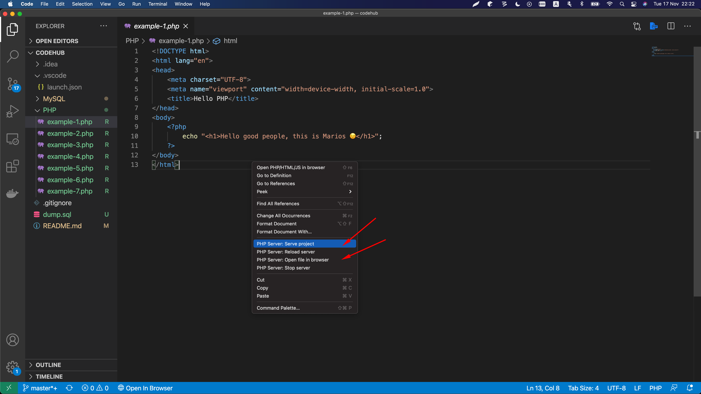
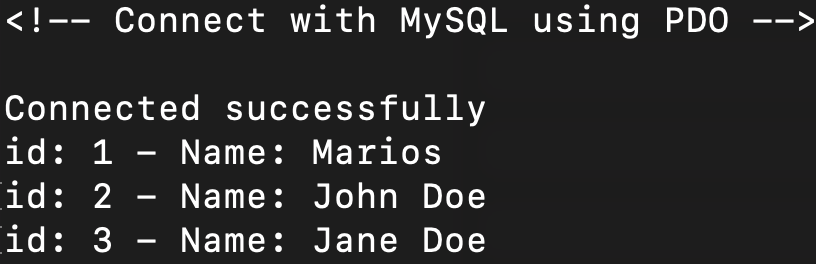

# Introduction to PHP and MySQL

In order to run these exercises we need to install the following technologies locally:

- PHP 7.4
- MySQL 8

## Run PHP Examples

These examples aim to help students to grasp the fundamental principles of PHP.

You need to follow some steps in order to run these PHP examples in your machine:

1. Install PHP 7.4 locally

2. Install [Visual Studio Code](https://code.visualstudio.com/) so you can open and tweak the examples under [PHP](./PHP) folder

3. Open Visual Studio Code and install the [PHP Server](https://github.com/brapifra/vscode-phpserver) extension so you can run PHP through your IDE. At this stage you should have installed already PHP 7.4 locally

4. Select an example and launch the PHP server through the context menu with right click by selecting "PHP Server: Serve project". The server needs to start just once. From now on, just select "PHP Server: Open file in browser" to play with the rest examples



## Run MySQL Examples

These are some simple PHP examples where we connect with MySQL through MySQLi and PDO in order to retrieve actual data from the DB.

You need to follow some steps in order to run these examples in your machine:

1. Setup PHP 7.4 locally first, as shown in the section above

2. Setup MySQL 8 locally

3. Connect with MySQL:

```bash
$ mysql -u root -p
```

4. Create a DB named "demo":

```bash
$ mysql> create database demo;
```

5. Select the "demo" database and run the [dump.sql](./assets/dump.sql) script that is included in the assets folder:

```bash
$ mysql> use demo;
$ mysql> source dump.sql;
```

6. Execute an example in the command line:

```bash
$ php example-1.php
```

